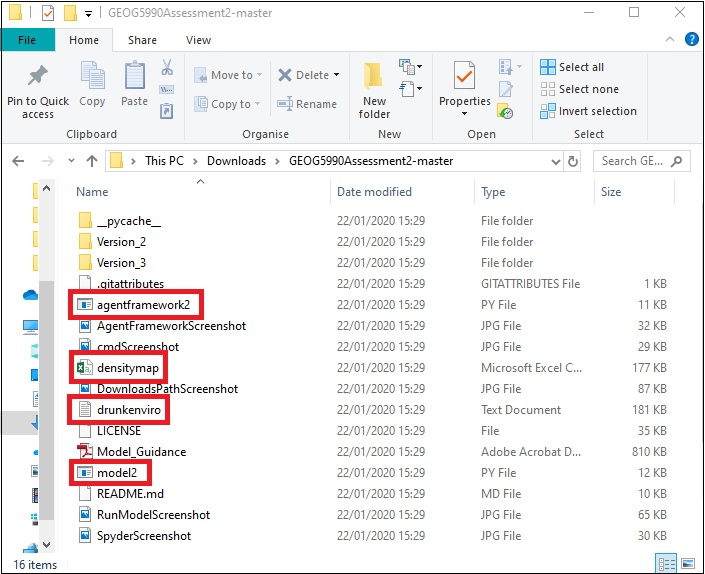
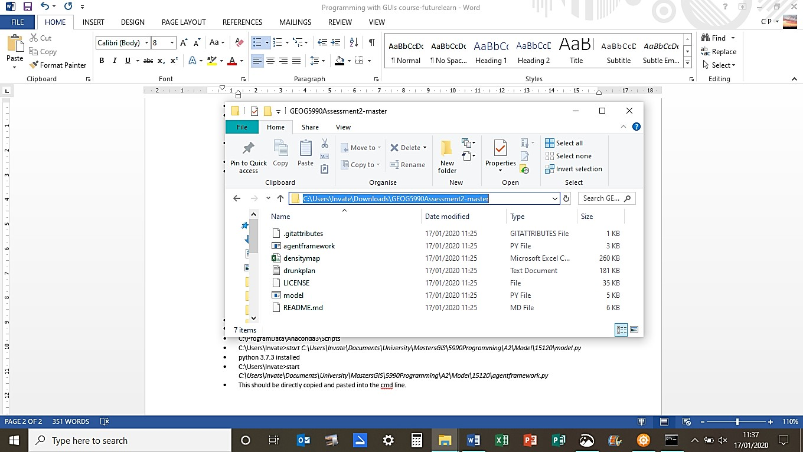
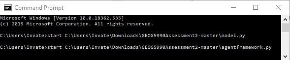
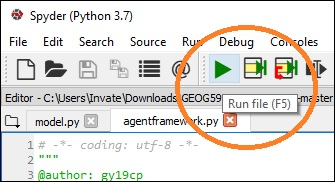
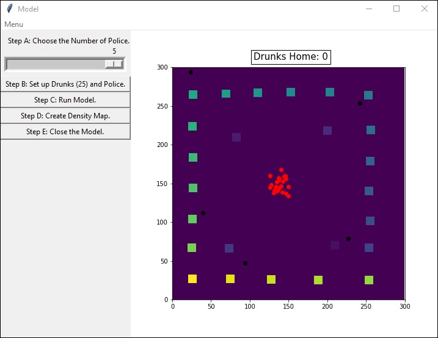

# GEOG5990 Assessment 2 
## Independent Project - Town Planning for Drunks

Programming for Geographical Information Analysts: Core Skills

Student ID: 201376715

Website: [gy19cp.github.io](https://gy19cp.github.io/index.html)

A concise Model Summary can be found by selecting ['Model 2'](https://gy19cp.github.io/model2summary.html) in the sidebar on the website. Afterwards, an in-depth Model document can be found [here](https://gy19cp.github.io/------.html). 

This animated agent-based model uses 25 Drunks within a 300 by 300 raster grid environment. Drunks randomly move from the Pub to their respective Homes. Drunks can be guided by Police to their homes. Movements are tracked and a Microsoft Excel csv Density document is produced once a button within the Graphical User Interfacce (GUI) is pressed. 

Some issues exist as detailed in the in-depth document mentioned above. Previous versions (2 & 3) are available to run, containing different working functions. If Version 1 (most up-to-date model), Version 2 and 3 were all merged it would produce the ideal working model. 

### Contents
-	[Model*](https://gy19cp.github.io/model2.py) - Current up-to-date Model (Version 1) to download and run. It contains detailed explanatory comments, testing and debugging. 
-	[Agent Framework*](https://gy19cp.github.io/agentframework2.py) - Code for Agents in the Model.
-	[drunkenviro.txt*](https://gy19cp.github.io/drunkenviro.txt) - Text file that contains the values for the Environment. 
- [Density](https://gy19cp.github.io/densitymap.csv) - Comma separated values file containing initial values for the Density Map. Values change once the model is run and the GUI button selected.
- [Model Guidance](https://gy19cp.github.io/------.html) - In-depth PDF document with detail on the software intention, current issues, design, UML Diagrams and future developments.
- [License](https://github.com/gy19cp/GEOG5990Assessment2/blob/master/LICENSE) - GNU General Public License v3.0 agreement for the Repository code.
- [Pycache](https://github.com/gy19cp/GEOG5990Assessment2/tree/master/__pycache__) - Folder directory automatically generated by Python containing bytecode cache files. 
- [Version 2](--------) folder - Previous Model version. This is semi-working, with a working animation, however Drunks start at home, this should happen at the end of the model and the excel document does not get written in.
- [Version 3](------------) folder - Previous Model version. This is the oldest working version with no animation, all written into the iPython console.
- .jpg files - Screenshots to aid Instructions below.
- git.attributes - Settings specified for a path.
 

The __*__ indicates that it is essential to download these files in order to run the model. 
These files download once selected. The drunkenviro.txt file opens in the same tab so it is advisable to open in a new tab or save the drunkenviro.txt file, before selecting the back command to return to this page.

## Software Used
Spyder within Anaconda 3, Python 3.7.3, Command Prompt.

## Model Instructions 

**Step 1 -** Open Spyder (Anaconda 3). If you have not got this downloaded, it can be installed through the Anaconda Distribution [here](https://www.anaconda.com/distribution/). All code works with Python 3.7.3. Ensure when going through the installation process that you download ‘Spyder’. 

**Step 2 -** Download the necessary files by clicking on the following hyperlinks - [Model2](http://gy19cp.github.io/model2.py), [Agent Framework2](http://gy19cp.github.io/agentframework2.py) and [drunkenviro.txt](https://gy19cp.github.io/drunkenviro.txt). All these files should be downloaded to the computers ‘Downloads’ folder. 

**Alternative Step 2 -** Complete Step 2 above or this step, not both. Alternatively you can select this [Repository](https://github.com/gy19cp/GEOG5990Assessment2) hyperlink, which will take you directly to the Assessment 2 Repository within the GitHub website. Once in the Repository, select the green ‘Clone or download’ button (on the right hand side) and ‘Download Zip’. Files downloaded to the ‘Downloads’ folder this way will need to be ‘extracted’ before appearing as individual files as shown below. To extract files, right click on the zipped folder and select 'extract all', making sure to choose a suitable location for the files. Both Step 2 methods are equally effective.  

 

**Step 3 -** Once downloaded, change the application python files automatically opens as to Spyder rather than Python (command line). Right click either file, highlight 'Open with' and select 'Choose another app'. If ‘Spyder’ is not under ‘Other options’, select ‘More Apps’ and ‘Look for another App on this PC’. Locate the original Spyder application file. Changing this setting enables python files to open with Spyder, saving time in the future.

**Step 4 -** Open 'cmd' from the Start Menu. Opening Model and Agent Framework through the Command Prompt allows experienced users to work faster and requires fewer system resources (e.g. hard disk space, RAM) once set up (than if the equivalent GUI was used) (Janssens, 2015). To do this obtain the path where the files are stored. Path in ‘Downloads’ is copied from the address bar, \model2.py or \agentframework2.py will need adding to the path end. 

 

**Step 5 -** Within the Command Prompt, a similar path to below should be inputted. Same paths can be used every time the files needs to be opened. Once model.py path inputted, enter pressed and Spyder opened, open Command Prompt press the up arrow and the previous line shows. Delete ‘model2.py’ and input ‘agentframework2.py’. Both model2.py and agentframework2.py will be open in Spyder. 

 

**Step 6 -** Have the 'agentframework2.py' file selected within Spyder and click the green right-pointed arrow to ‘Run’ it.

  
**Step 7 -** Now select the 'model2.py' file within Spyder and click ‘Run’ once more. When the Model pops out it contains a Graphical User Interface with 5 clearly marked Steps A to E. A text box with number of Drunks Home is also present.  

If any problems occur with the Graphical User Interface, a dropdown 'Menu' above the buttons allows the Model to 'Run' and 'Close'. 
 

 
## Model Expectations 
The red dots represent the 'Drunks' and the black dots represent 'Police'. When the Model is opened, the pub is located. This is printed in the iPython console. Then within the Model GUI the user selects the number of Police required using the slider. Drunks are kept at 25, as there are 25 homes. When the Step B button is clicked, the number of Drunks and Police chosen as well as whether each agent is currently at home ('True') or not ('False') is printed in the iPython Console. Drunks start off at the Pub, so 'False' will be initially printed. Next, the model is run, Drunks start at the Pub in the centre and attempt to get to their specific home. Police try to guide them. 

As Drunks are moving they leave behind a small purple-white trail to show their movements. When a Drunk reaches home, they turn from red to green, stop moving and the number in the 'Drunks Home' text box increases. The Density file, where the numbers within it increase by 1 every time an agent moves an iteration, can be created by selecting the Step D button. 

The Model can be manually closed by clicking Step E, otherwise the model will stop when either a specified number of iterations has been reached, all 25 Drunks reach home or unfortunately when Police guide a Drunk to coordinates (300, 300). This is an ongoing issue outlined in the PDF documentation above. Once the Model ends naturally, it can be rerun by closing and reopening the model. 

After timing the model 5 times. Average Model Running Time is 3 minutes 31 seconds with 1 Police selected or 1 minute 35 seconds with 5 Police person selected. Timing will vary with the number of Police chosen within the Model and is likely to increase once errors have been fixed. Timing can be sped up by increasing numbers within the 'move' function in the agentframework2.py.

## Licence 
[GNU General Public License v3.0](https://github.com/gy19cp/GEOG5990Assessment2/blob/master/LICENSE) 
 agreement for the Repository code.

## Further Detail 
**Potential Known Issues**, **Information Architecture Design Choices**, **Testing**, **UML Diagrams** and **Potential Development Roadmap** are detailed in the [Model Guidance]() document uploaded at the top.

## Reference List
Janssens, J., 2015. *Data Science at the Command Line: Facing the Future with Time-Tested Tools*. 2nd ed. Cambridge: O'Reilly.

## Final Points
I do not condone any form of drunk or disordely behaviour. This model was an independent project representing skills developed following the [Programming for Geographical Information Analysts: Core Skills module](https://www.geog.leeds.ac.uk/courses/computing/study/core-python/) as part of an MSc GIS from the University of Leeds. 

