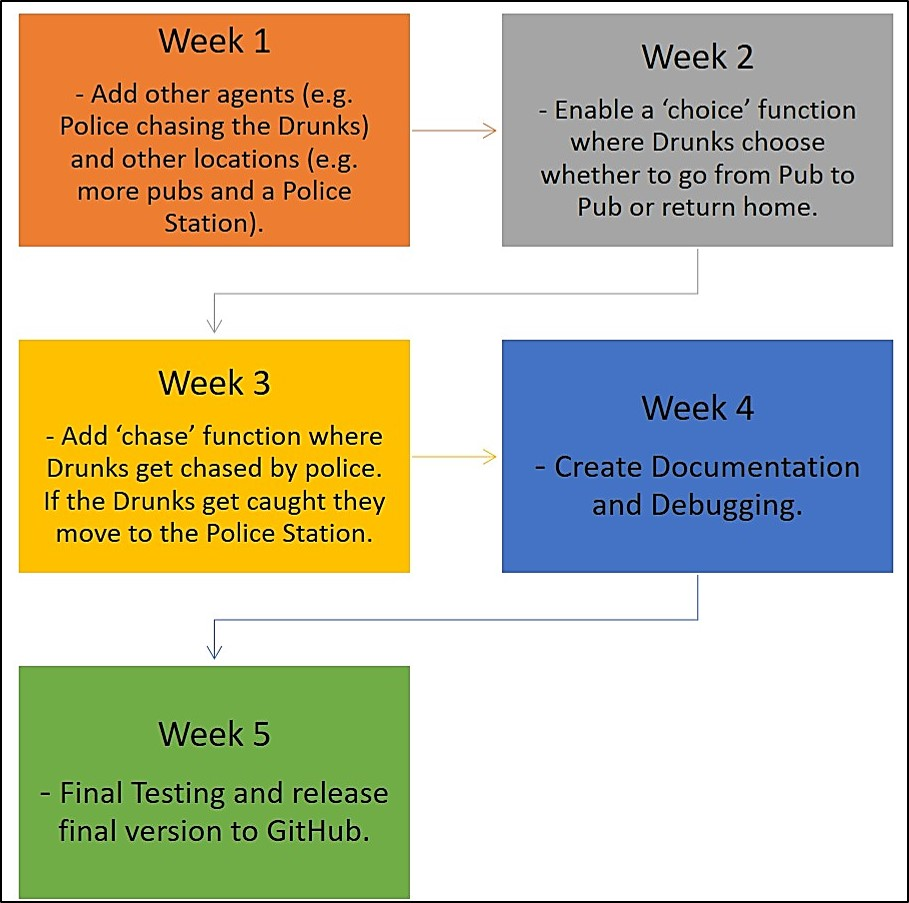

# GEOG5990 Assessment 2 
## Independent Project - Town Planning for Drunks

Programming for Geographical Information Analysts: Core Skills
Student ID: 201376715

Website: [gy19cp.github.io](https://gy19cp.github.io/index.html)

A concise Model Summary can be found by selecting ['Model 2'](https://gy19cp.github.io/model2summary.html) in the sidebar on the website.

This animated agent-based model uses 25 Drunks within a 300 by 300 raster grid environment. Drunks randomly move from the Pub to their respective Homes. Their movements are tracked and a density map is produced once all 25 people reach their respective home. 

### Model Files/Directories List
-	[Model*](https://gy19cp.github.io/model2.py) - Model to download and run. It contains detailed explanatory comments, testing and debugging. 
-	[Agent Framework*](https://gy19cp.github.io/agentframework2.py) - Code for Agents in the Model.
-	[drunkplan.txt*](https://gy19cp.github.io/drunkplan.txt) - Text file that contains the values for the Environment. 
- [Density Map](https://gy19cp.github.io/densitymap.csv) - Comma separated values file containing initial values for the Density Map. Values change once the model is run as movements by Drunks change each time.
- [License](https://github.com/gy19cp/GEOG5990Assessment2/blob/master/LICENSE) - GNU General Public License v3.0 agreement for the Repository code.
- [Pycache](https://github.com/gy19cp/GEOG5990Assessment2/tree/master/__pycache__) - Folder directory automatically generated by Python containing bytecode cache files. 

The __*__ indicates that it is essential to download these files in order to run the model. 
These files download once selected. The drunkplan.txt file opens in the same tab so it is advisable to open in a new tab or save the drunkplan.txt file, before selecting the back command to return to this page.

## Model Instructions 

**Step 1 -** Open Spyder (Anaconda 3). If you have not got this downloaded, it can be installed through the Anaconda Distribution [here](https://www.anaconda.com/distribution/). All code works with Python 3.7. Ensure when going through the installation process that you download ‘Spyder’. 

**Step 2 -** Download the necessary files by clicking on the following hyperlinks - [Model](http://gy19cp.github.io/model2.py), [Agent Framework](http://gy19cp.github.io/agentframework2.py) and [drunkplan.txt](https://gy19cp.github.io/drunkplan.txt). All these files should be downloaded to the computers ‘Downloads’ folder. 

**Alternative Step 2 -** Complete Step 2 above or this step, not both. Alternatively you can select this [Repository](https://github.com/gy19cp/GEOG5990Assessment2) hyperlink, which will take you directly to the Assessment 2 Repository within the GitHub website. Once in the Repository, select the green ‘Clone or download’ button (on the right hand side) and ‘Download Zip’. Files downloaded to the ‘Downloads’ folder this way will need to be ‘extracted’ before appearing as individual files as shown below. To extract files, right click on the zipped folder and select 'extract all', making sure to choose a suitable location for the files. Both Step 2 methods are equally effective.  

 

**Step 3 -** Once downloaded, open Spyder and within it the Agent Framework file and Model file.

**Step 4 -** Have the 'agentframework.py' file selected within Spyder and click the green right-pointed arrow to ‘Run’ it.

  
**Step 5 -** Now select the 'model.py' file within Spyder and click ‘Run’ once more. When the Model pops out it contains a Graphical User Interface with 3 clearly marked Steps A to C. ...... A text box with number of Drunks Home is also present.  

If any problems occur with the Graphical User Interface, a dropdown 'Menu' above the buttons allows the Model to 'Run' and 'Close'. 
 

 
## Model Expectations 
.............................

## Potential Known Issues
- .............
- It is recommended to open the Model on a Windows Operating System. However, when doing so a pop up box entitled 'Figure' will appear alongside the 'Model' box. This is a preknown issue that occurs with Windows. This Figure box is not used. To close the Model fully before restarting and rerunning the Model, both the Model and the Figure box need to be closed and the red square in the IPython console selected (if it is not already greyed out).
- .....................

## Testing Completed
- Throughout the Agent Framework and Model, specific text is printed or 'returned' to show a certain action has occurred. For instance, '..........' is printed. 
- Statements with 'if' and 'else' are used. If one outcome does not occur then another outcome will happen instead. For instance, if a Drunk reaches their home, they turn green. If the Drunk does not reach home, they turn red.

## Future Developments Roadmap 2020

## Final Points
I do not condone any form of animal cruelty. This model was an independent project representing skills developed following the [Programming for Geographical Information Analysts: Core Skills module](https://www.geog.leeds.ac.uk/courses/computing/study/core-python/) as part of an MSc GIS from the University of Leeds. 

